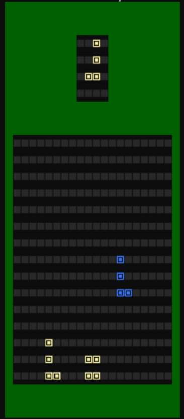

# Tetris Terminal Game

Welcome to Tetris Terminal Game, an terminal game version of the classic Tetris Game developed for INFOSCI-102 FINAL PROJ.

## Preview
Here is the preview GIF:
<div align="center">
  
</div>

## How to Play

To play this game, follow these simple steps:

1. To start the game, double click the `Tetris.exe` file, or enter the command:
```bash
python main.py
```
2. To control the block, press keyboard `A` and `D` buttons to apply left or right move, press keyboard `Q` and `R` buttons to rotate counterclockwise or clockwise, and press keyboard `D` button to immediately drag down.
3. Press keyboard `SPACE` button to pause the game, and press keyboard `ESC` button to quit the game.

## About the Game

Tetris Terminal Game is a FINAL PROJ for DKU INFOSCI-102. This adds on some advanced features based on the original game.

## Requirements

Make sure you have Python installed (>=3.10.6) on your system to run the game successfully.

## Notes

This is a course PROJ. Feel free to contribute to the project by submitting bug reports or suggesting improvements. Feedback and ideas are welcomed to make Tetris Terminal Game better.

Happy gaming! 🎮
